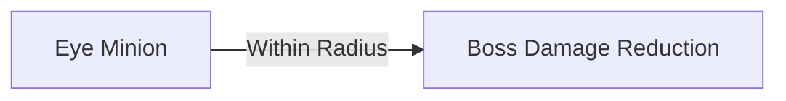

# True Eye (The Watcher of Terror)

*"The all-seeing terror that pierces through dimensions"*

## 📊 Base Stats
| Attribute              | Value                         |
|------------------------|-------------------------------|
| Health (HP)            | 22,000 (scales by difficulty) |
| Contact Damage         | 55 (scales by phase)          |
| Sight Distance         | Global (99,999)               |

### 🛡️ Defense Attributes (Base)
| Damage Type   | Physical | Magical | Piercing |
|---------------|----------|---------|----------|
| Resistance    | -5 | 8 | 2 |

**Difficulty Scaling**: 
- For each difficulty level above 0, all resistances increases:

| Difficulty    | Resistance Change |
|---------------|-------------------|
| Easy / Normal | Unchanged |
| Mastery       | +11 to all resistances |
| Ultimate      | +22 to all resistances |

---

## 🔄 Phase Transitions
True Eye evolves through 3 combat phases:

| Phase | HP Threshold | Visual Change                     | Defense Change | Contact Dmg | Special Effect |
|-------|--------------|-----------------------------------|----------------|------------|----------------|
| **1** | 100%-70%     | Default form                      | Base values    | 55         | -              |
| **2** | ≤70%         | Red form (`entity_true_eye_phase2`)| **-20 all**    | 65         | 100-frame invincibility |
| **3** | ≤30%         | Dark form (`entity_true_eye_phase3`)| **-5 all**     | 80         | 100-frame invincibility |

> 💡 *Phase transitions reset the action timer and immediately change attack patterns*

---

## ⚔️ Attack Patterns
Action cycle: `350 + phase×100` frames  
*(Phase1: 350f, Phase2: 450f, Phase3: 550f)*

### 🔁 Core Mechanics
- **Rotation**: 
  - Invincible state: Fixed rotation (12°/frame)
  - Active state: Smooth tracking of player
- **Minion Summoning**:
  - Regular: Spawns `Eye` minion below boss every `80 - difficulty×15` frames
  - Burst: At 540f, spawns `5 + difficulty×8` Eyes in 200px radius

### ⏱️ Timer-Based Actions
| Timer Range   | Behavior                                                                 |
|---------------|--------------------------------------------------------------------------|
| **0-100f**    | Charges **away** from player (Force: `20 - phase×5`)                    |
| **101-200f**  | Charges **toward** player (Force: `120 + phase×240`)                    |
| **201-End**   | Every `50 - phase×10` frames: • Locks player direction • 12-frame charge (Force: `2000 - phase×200`) |

> ⚠️ **Master/Ultimate Mechanic**: At difficulty≥2, charge starts with extreme slowdown (velocity ÷10,000)

---

## 🎚️ Difficulty Mechanics
### 👁️ Eye Minion Damage Reduction (Difficulty≥1)

- **Activation Radius**: `400 × (difficulty - 1)` pixels
- **Reduction per Eye**:
- 
  | Difficulty | Reduction per Eye |
  |------------|------------------|
  | Normal (1) | 1%               |
  | Master (2) | 10%              |
  | Ultimate (3)| 25%             |
  
**Formula**:  
`Final Damage = Raw Damage × (1 - EyeCount × Reduction)`

> 🔴 *Visual indicator: Red lines connect Boss and Eyes*

### 🔊 Roaring Mechanic
- Triggers `eoc_roar` sound every `50 - phase×10` frames
- Only activates when timer ≥200f and not invincible

---

## 🎁 Loot Table
### 💯 Guaranteed Drops
- `Aimer` ×1
- `Tip2` ×1
- **One random ring**:
  - `Orange Ring`
  - `Blue Ring`
  - `Green Ring`

### 🎲 Probabilistic Drops
| Item          | Quantity | Drop Rate |
|---------------|----------|-----------|
| Blood Ingot   | 1        | 20%-30%   |
| Platinum      | 1        | 20%-30%   |

---

## 🧠 Combat Tactics
1. **Phase Transition Windows**  
   Focus damage after invincibility ends when defenses are lowered

2. **Minion Priority**  
   High difficulties require immediate Eye elimination:
   - 4 Eyes in Ultimate = 100% damage reduction
   - 10 Eyes in Master = 100% damage reduction

3. **Charge Management**  
   - **0-100f**: Safe melee window (boss moves away)
   - **101-200f**: Evade and range attack
   - **Locked Direction**: Sidestep charge trajectories

4. **Ultimate Difficulty**  
   Strict crowd control needed to prevent >90% damage reduction

> "A symphony of movement and minion control - the true test of battlefield awareness"